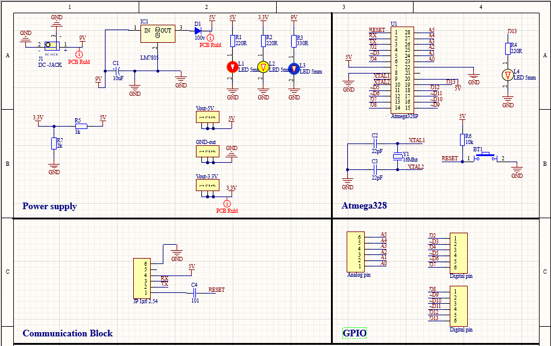
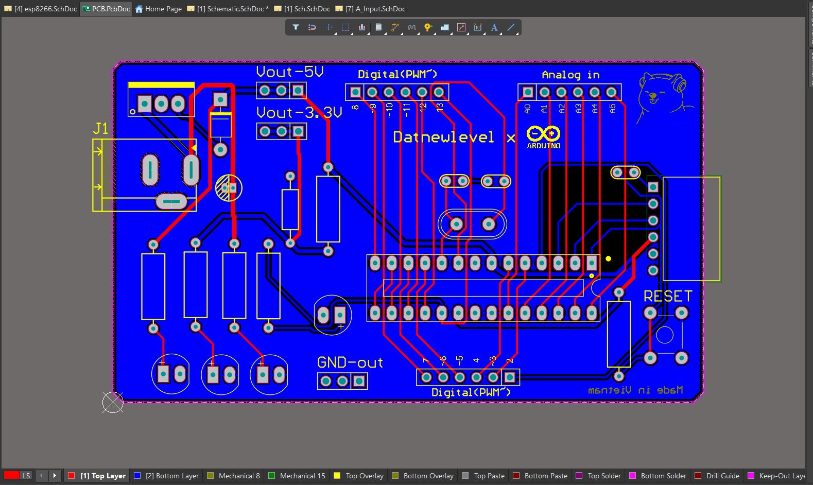
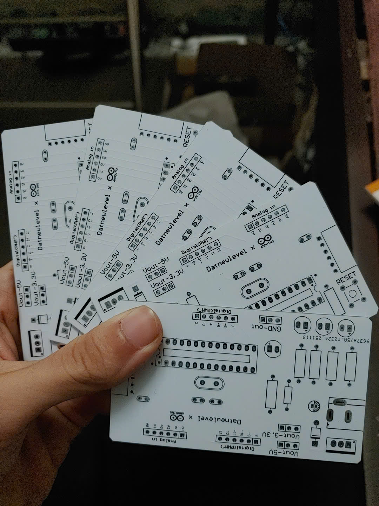
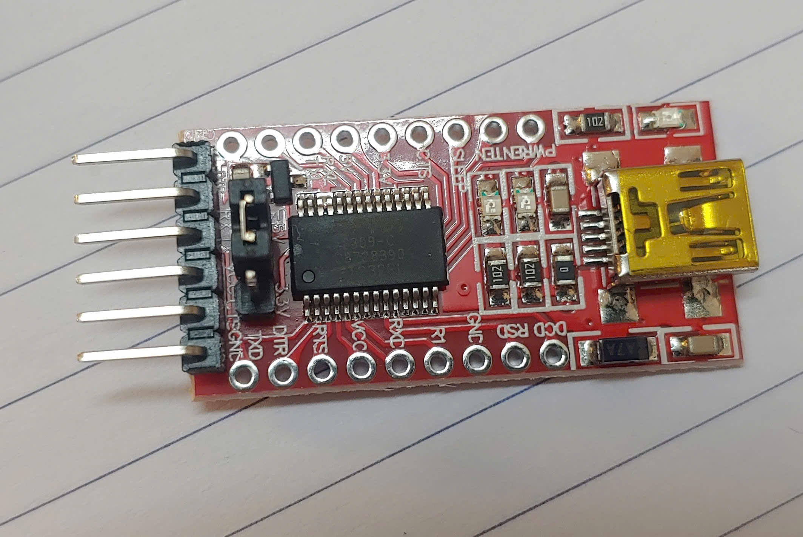
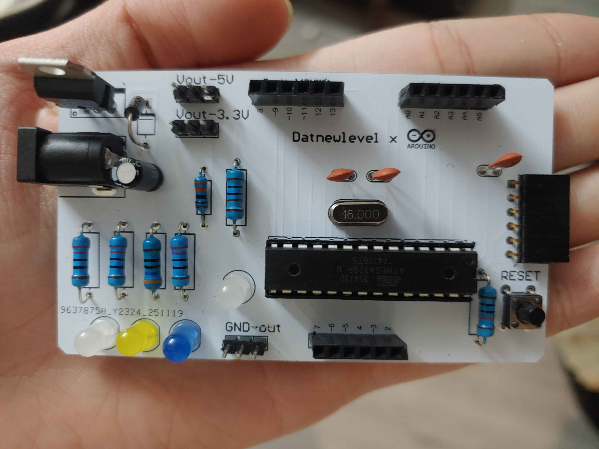
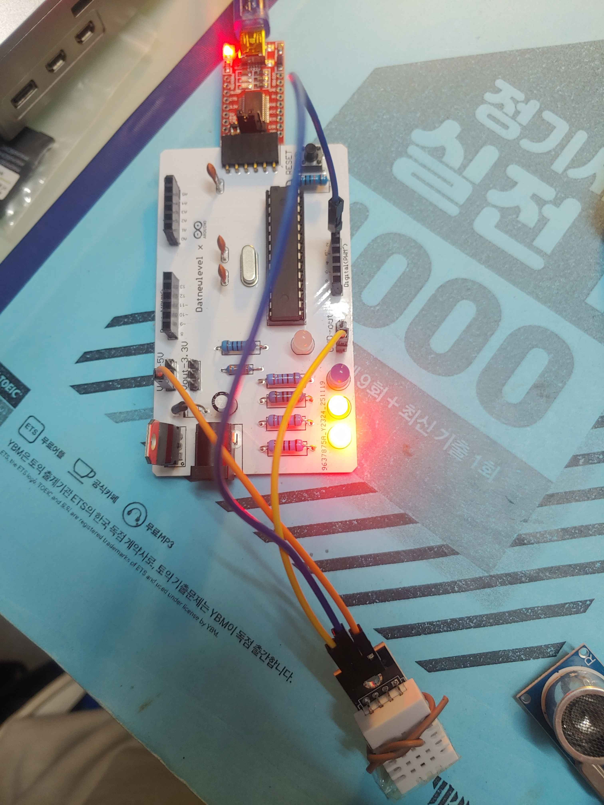
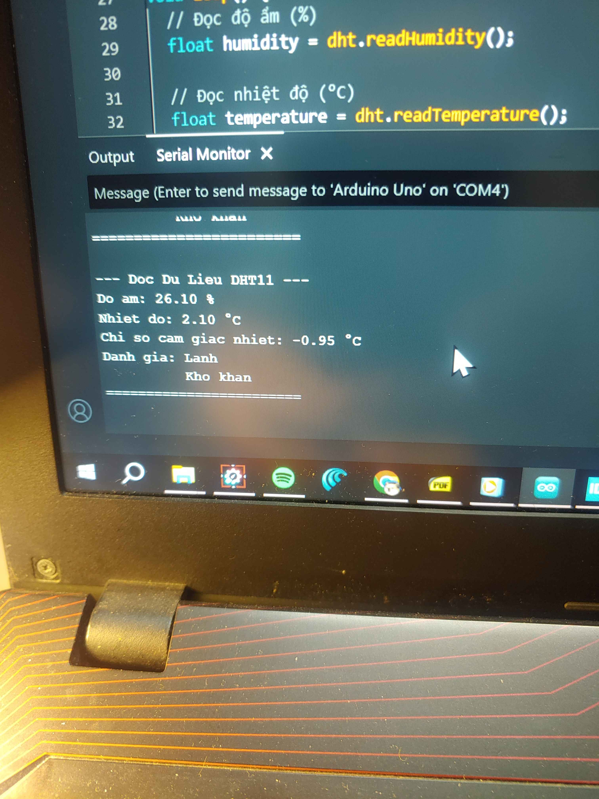
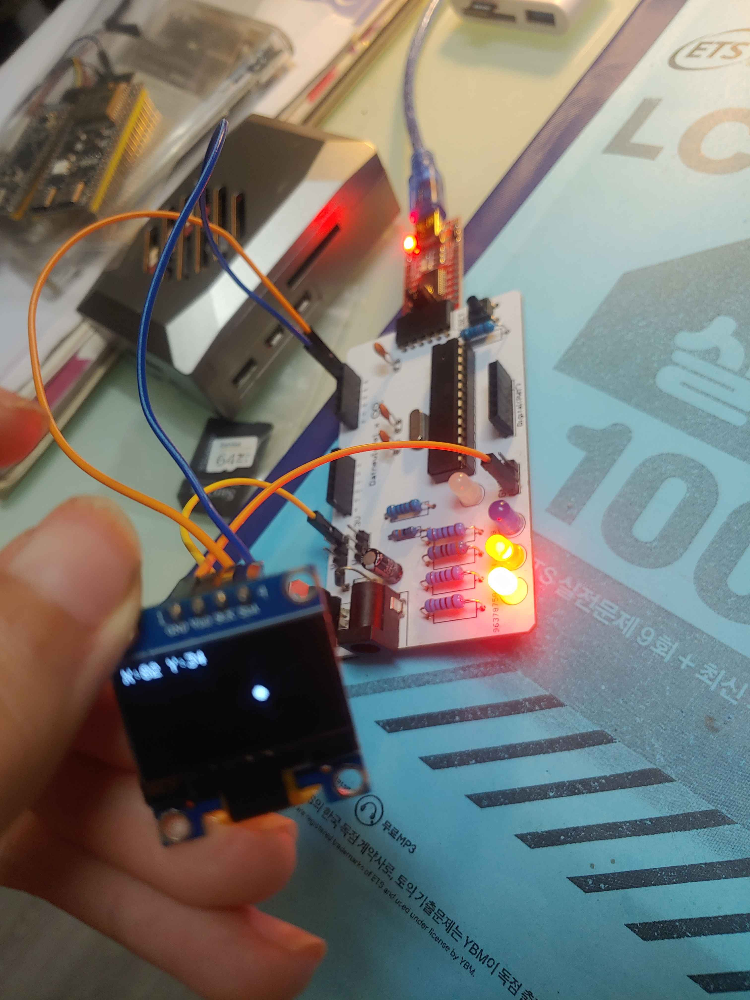
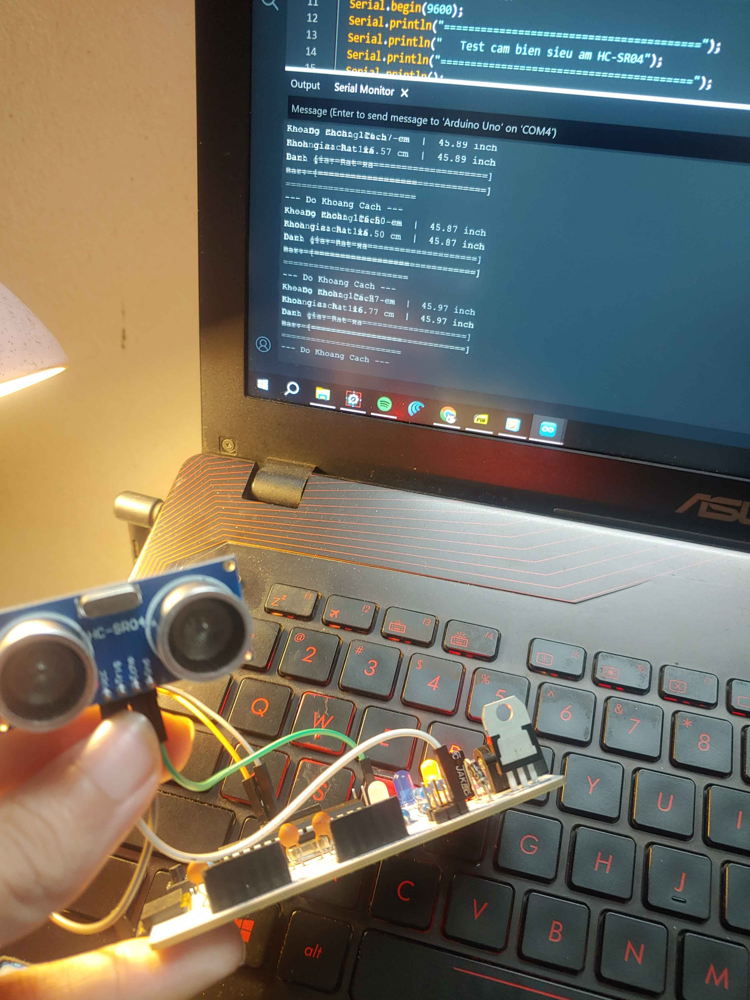

# Custom Arduino-Compatible Development Board

*Designed and documented by* [**Đỗ Bảo Đạt**](https://github.com/Datnewlevel)

 

## Overview

A personal project to design a custom Arduino-compatible development board — a
personalized take on the Arduino Uno R3 with a few targeted improvements.

Instead of an onboard communication chip, the board uses an external USB-to-UART
module built around the **FT232RL**, keeping the board itself simpler and the
communication hardware swappable.

## Improvements Over the Arduino Uno R3

| Change | Detail |
| --- | --- |
| **Extra power pins** | Additional header rows for 5V and 3.3V, making it easier to connect peripherals and modules without daisy-chaining off the existing rails |
| **Custom layout** | Component placement and board outline redesigned for a personal touch and optimized for specific use cases |

## Design Software

Schematic and PCB layout were both designed in **Altium Designer**.

## Project Images

**Schematic**

**PCB Layout**

**Finished Board**

**USB-to-UART Communication Module**

**Final Product**

## Board Testing

Basic peripheral tests run against the finished board to confirm functionality.

**Temperature sensor (DHT11)**

| Test 1 | Test 2 |
| --- | --- |
|  |  |

**OLED display (0.96")**

**Ultrasonic sensor (SR04)**

---

Design and documentation © <a href="https://github.com/Datnewlevel">Đỗ Bảo Đạt</a>. Shared here as part of UTT UAV Club's hardware work.

